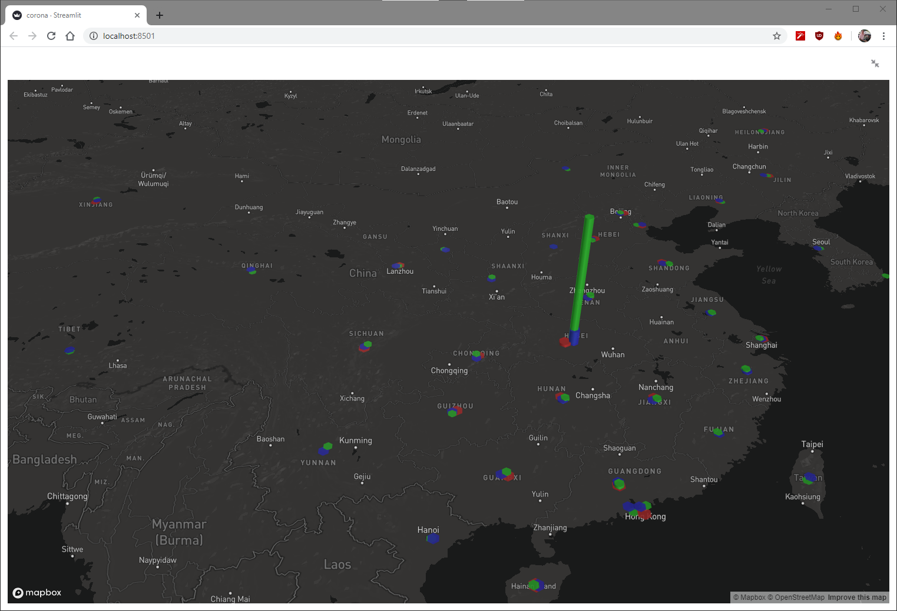

# Corona virus statistics
Just playing with [streamlit](https://www.streamlit.io/) library.
The source data can be found [here](https://github.com/CSSEGISandData/COVID-19/tree/master/csse_covid_19_data/csse_covid_19_time_series).

:)

To run you need to install streamlit:
```pip install streamlit```

After installing you can run:


And in the browser:




