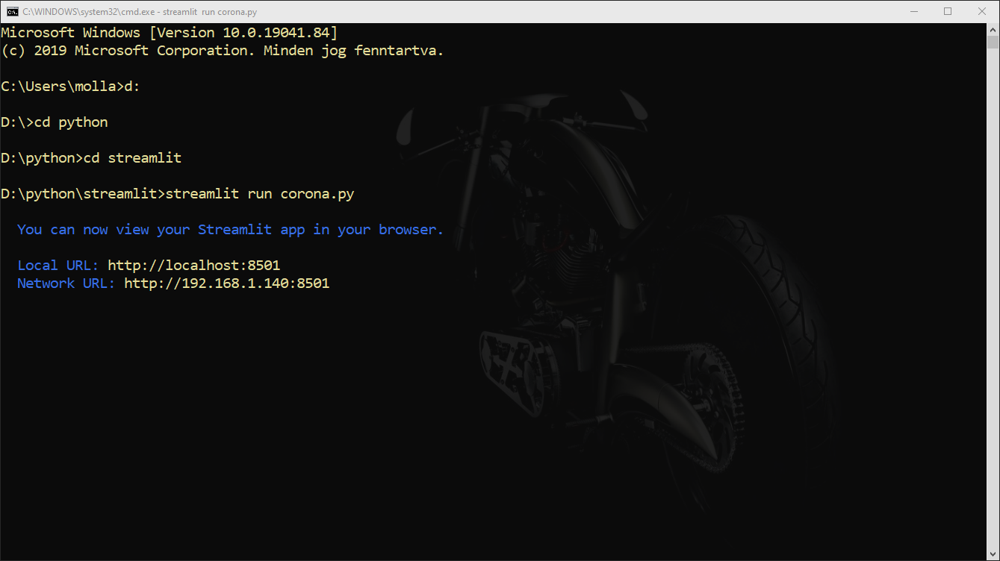
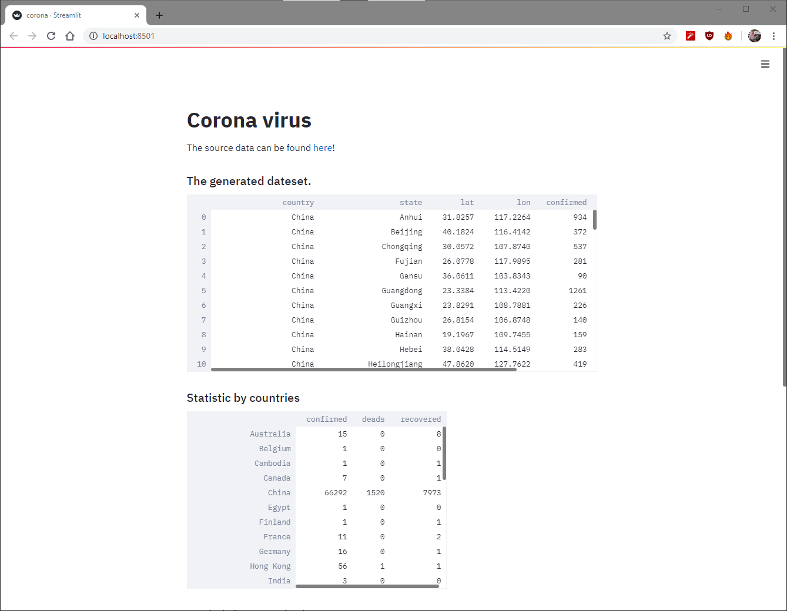
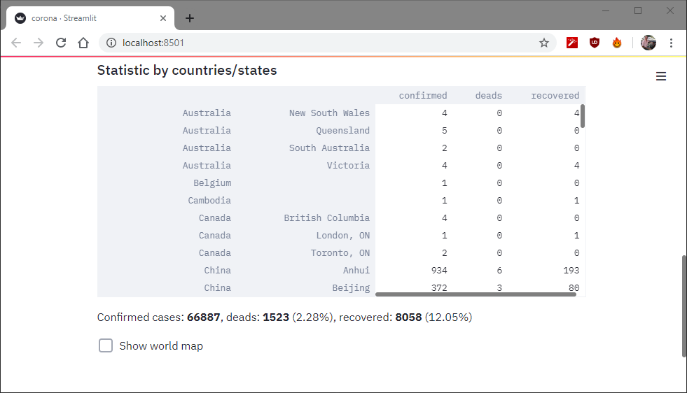
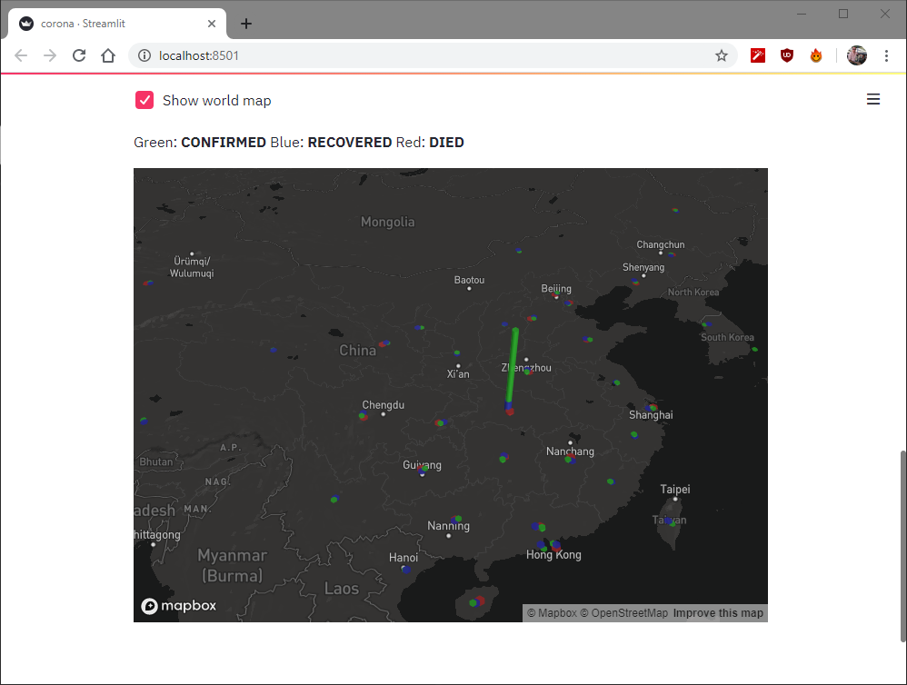

# Corona virus statistics
Just playing with (streamlit)[https://www.streamlit.io/] library. :)

To run you need to install streamlit:
```pip install streamlit```
After installing you can run:


And in the browser:






